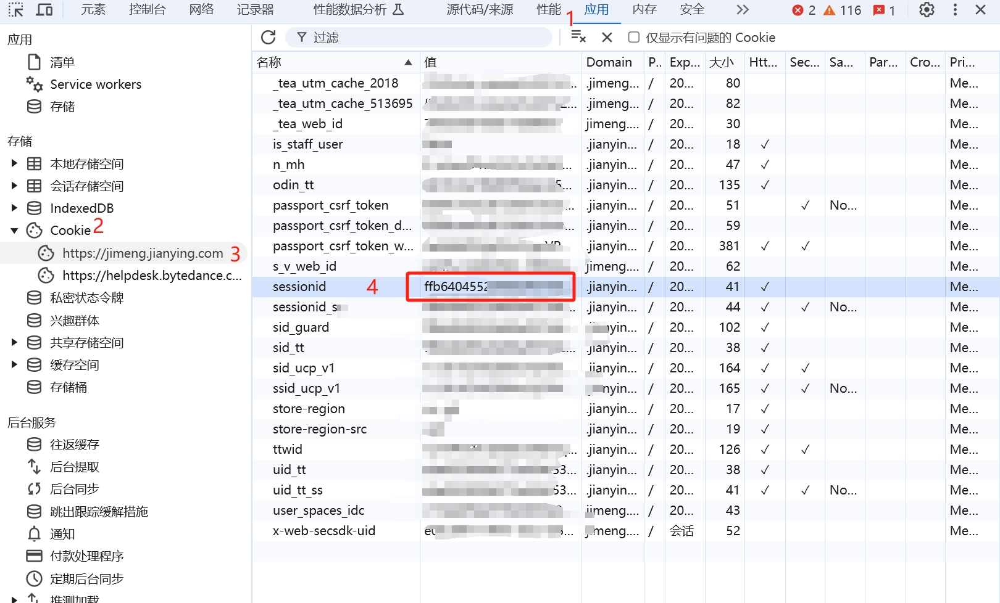

# Jimeng AI Free 服务

支持即梦超强图像生成能力，包含最新即梦4.0文生图模型、文生图、图生图功能，视频生成模型（目前官方每日赠送 66 积分，可生成 66 次），零配置部署，多路 token 支持。

与 OpenAI 接口完全兼容。


## 免责声明

**逆向 API 是不稳定的，建议前往即梦 AI 官方 https://jimeng.jianying.com/ 体验功能，避免封禁的风险。**

**本组织和个人不接受任何资金捐助和交易，此项目是纯粹研究交流学习性质！**

**仅限自用，禁止对外提供服务或商用，避免对官方造成服务压力，否则风险自担！**

**仅限自用，禁止对外提供服务或商用，避免对官方造成服务压力，否则风险自担！**

**仅限自用，禁止对外提供服务或商用，避免对官方造成服务压力，否则风险自担！**

## 接入准备

从 [即梦](https://jimeng.jianying.com/) 获取 sessionid

进入即梦登录账号，然后 F12 打开开发者工具，从 Application > Cookies 中找到`sessionid`的值，这将作为 Authorization 的 Bearer Token 值：`Authorization: Bearer sessionid`



### 多账号接入

你可以通过提供多个账号的 sessionid 并使用`,`拼接提供：

`Authorization: Bearer sessionid1,sessionid2,sessionid3`

每次请求服务会从中挑选一个。

## 效果展示


多图合成


文生视频3.0


## Docker 部署

1.  **拉取代码库**
    ```bash
    git clone https://github.com/zhizinan1997/jimeng-free-api-all.git
    ```
    *   **提示**: 如果您已将此项目 Fork 到自己的 GitHub 账号，请将上述命令中的 `https://github.com/zhizinan1997/jimeng-free-api-all.git` 替换为**您自己 Fork 后的仓库地址**。

2.  **进入项目文件夹**
    ```bash
    cd jimeng-free-api-all
    ```

3.  **构建 Docker 镜像**
    ```bash
    docker build -t jimeng-free-api-all:latest .
    ```
    *   此命令将根据项目中的 `Dockerfile` 构建一个名为 `jimeng-free-api-all` 的本地镜像。

4.  **启动 Docker 容器**
    ```bash
    docker run -it -d --init --name jimeng-free-api-all -p 8000:8000 -e TZ=Asia/Shanghai jimeng-free-api-all:latest
    ```
    *   `-p 8001:8000`: 将宿主机的 `8001` 端口映射到容器内部的 `8000` 端口。您可以根据需要修改 `8001`。
    *   `-e TZ=Asia/Shanghai`: 设置容器内的时区为上海，确保日志和时间戳正确。

## dockerhub 镜像仓库
下载镜像
```bash
docker pull wwwzhouhui569/jimeng-free-api-all:latest
```
启动 Docker 容器
```bash
docker run -it -d --init --name jimeng-free-api-all -p 8001:8000 -e TZ=Asia/Shanghai wwwzhouhui569/jimeng-free-api-all:latest
```


## 接口列表

### 对话补全（绘制图像&生成视频）

目前支持与 openai 兼容的 `/v1/chat/completions` 接口，可自行使用与 openai 或其他兼容的客户端接入接口，模型名称包括：
- **文生图模型**：`jimeng-4.0`、`jimeng-3.1`、`jimeng-2.1`、`jimeng-2.0-pro`、`jimeng-2.0`、`jimeng-1.4`、`jimeng-xl-pro`
- **视频生成模型**：`jimeng-video-3.0`、`jimeng-video-3.0-pro`、`jimeng-video-2.0`、`jimeng-video-2.0-pro`

使用文生图模型时支持智能多图生成（jimeng-4.0 支持连续场景、绘本故事等多张图片生成），使用视频模型时为视频生成。

### 视频生成

视频生成接口，支持通过直接调用video接口或通过chat接口使用视频模型生成视频。

**POST /v1/videos/generations**

header 需要设置 Authorization 头部：

```
Authorization: Bearer [sessionid]
```

请求数据：

```json
{
  "model": "jimeng-video-3.0",
  "prompt": "视频描述文本",
  "width": 1024,
  "height": 1024,
  "resolution": "720p",
  "filePaths": ["首帧图片路径", "尾帧图片路径"]
}
```

响应数据：

```json
{
  "videoUrl": "https://v9-artist.vlabvod.com/..."
}
```
其他模型可另选jimeng-video-3.0/jimeng-video-3.0-pro-jimeng-video-2.0/jimeng-video-2.0-pro


### 图像生成

图像生成接口，与 openai 的 [images-create-api](https://platform.openai.com/docs/api-reference/images/create) 兼容。

#### 文生图接口

**POST /v1/images/generations**

header 需要设置 Authorization 头部：

```
Authorization: Bearer [sessionid]
```

请求数据：

```json
{
  // 支持模型：jimeng-4.0 / jimeng-3.1 / jimeng-2.1 / jimeng-2.0-pro / jimeng-2.0 / jimeng-1.4 / jimeng-xl-pro
  "model": "jimeng-4.0",
  // 提示词，必填。jimeng-4.0 支持多图生成，如"生成4张连续场景的图片"
  "prompt": "美丽的风景画，夕阳下的湖泊",
  // 反向提示词，默认空字符串
  "negative_prompt": "",
  // 图像宽度，默认1024
  "width": 1024,
  // 图像高度，默认1024
  "height": 1024,
  // 精细度，取值范围0-1，默认0.5
  "sample_strength": 0.5,
  // 响应格式：url 或 b64_json，默认 url
  "response_format": "url"
}
```

#### 图生图接口

**POST /v1/images/compositions**

支持多张输入图片的图像合成功能：

```json
{
  "model": "jimeng-4.0",
  "prompt": "将这些图片合成为一幅美丽的风景画",
  // 输入图片数组，支持 URL 字符串或对象格式
  "images": [
    "https://example.com/image1.jpg",
    {"url": "https://example.com/image2.jpg"},
    "https://example.com/image3.jpg"
  ],
  "negative_prompt": "",
  "width": 2560,
  "height": 1440,
  "sample_strength": 0.5,
  "response_format": "url"
}
```

响应数据：

```json
{
  "created": 1733593745,
  "data": [
    {
      "url": "https://p9-heycan-hgt-sign.byteimg.com/tos-cn-i-3jr8j4ixpe/61bceb3afeb54c1c80ffdd598ac2f72d~tplv-3jr8j4ixpe-aigc_resize:0:0.jpeg?lk3s=43402efa&x-expires=1735344000&x-signature=DUY6jlx4zAXRYJeATyjZ3O6F1Pw%3D&format=.jpeg"
    }
  ],
  "input_images": 3,
  "composition_type": "multi_image_synthesis"
}
```

#### 客户端 curl 调用示例

**文生图接口调用：**

```bash
curl -X POST http://localhost:8000/v1/images/generations \
  -H "Content-Type: application/json" \
  -H "Authorization: Bearer your_sessionid_here" \
  -d '{
    "model": "jimeng-4.0",
    "prompt": "美丽的日落风景，湖边的小屋",
    "width": 1024,
    "height": 1024,
    "sample_strength": 0.7,
    "response_format": "url"
  }'
```

**jimeng-4.0 多图生成：**

```bash
curl -X POST http://localhost:8000/v1/images/generations \
  -H "Content-Type: application/json" \
  -H "Authorization: Bearer your_sessionid_here" \
  -d '{
    "model": "jimeng-4.0",
    "prompt": "生成4张连续场景的图片：春夏秋冬四季风景",
    "width": 1024,
    "height": 1024,
    "sample_strength": 0.5
  }'
```

**图生图接口调用：**

```bash
curl -X POST http://localhost:8000/v1/images/compositions \
  -H "Content-Type: application/json" \
  -H "Authorization: Bearer your_sessionid_here" \
  -d '{
    "model": "jimeng-4.0",
    "prompt": "将这些图片合成为一幅充满创意的艺术作品",
    "images": [
      "https://example.com/image1.jpg",
      "https://example.com/image2.jpg"
    ],
    "width": 2560,
    "height": 1440,
    "sample_strength": 0.6,
    "response_format": "url"
  }'
```

**视频生成接口调用：**

```bash
curl -X POST http://localhost:8000/v1/videos/generations \
  -H "Content-Type: application/json" \
  -H "Authorization: Bearer your_sessionid_here" \
  -d '{
    "model": "jimeng-video-3.0",
    "prompt": "一只可爱的小猫在草地上玩耍",
    "width": 1024,
    "height": 1024,
    "resolution": "720p"
  }'
```


## 感谢

感谢 [jimeng-free-api-all](https://github.com/zhizinan1997/jimeng-free-api-all) 项目的贡献

感谢 [jjimeng-free-api](https://github.com/LLM-Red-Team/jimeng-free-api) 项目的贡献
